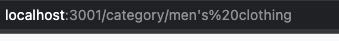
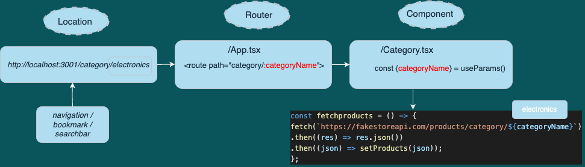
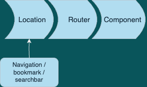

How to add dynamic routing to yor webpage

This article aims to explain how to create routes dynamically as well as makin dynamic api calls, depending on the selected route.

For this demonstration, we will use the example of a online-shop web prototype.

1. Create the navigation routes as a dynamic route.

`<Route path="category/:categoryName" element={<Categories />} />`

2. Create your navigation links.
   This example API (fakestore.api) allows to fetch just by category. This is nice to create our navigation bar categories by fetching them directly from the API.

```ts
const [categories, setCategories] = useState<string[]>([]);

useEffect(() => {
  const fetchProductCategories = () => {
    fetch("https://fakestoreapi.com/products/categories")
      .then((res) => res.json())
      .then((json) => setCategories(json));
  };
  fetchProductCategories();
}, []);
```

We will map through our **categories** array and for each category, we will add a link with our category name.

```ts
<Nav className="justify-content-end flex-grow-1 pe-3">
  {categories.map((cat) => (
    <Nav.Link as={Link} to={`category/${encodeURIComponent(cat)}`}>
      {cat.toUpperCase()}
    </Nav.Link>
  ))}
</Nav>
```

Keep in mind that if your string has spaces or special characters, you will need to use the method `encodeURIComponent()`, which will turn a string such as _"men's clothing"_ into a URI:



3. The component that will render your contents dinamically will receive the parameter from the router (in this example **categoryName**).

```js
function App() {
  return (
    <>
      <Navigation />
      <Container fluid className="vh-100">
        <Routes>
          <Route path="category/:categoryName" element={<Categories />} />
        </Routes>
      </Container>
    </>
  );
}
```

```ts
export const Categories = () => {
  const { categoryName } = useParams();
};
```

This parameter, that will be different depending on which path we click on our navbar( or type on our browser), can be used in the API call to dinamically fetch our categories. If the **categoryName** exists, the products of that category will be rendered.




